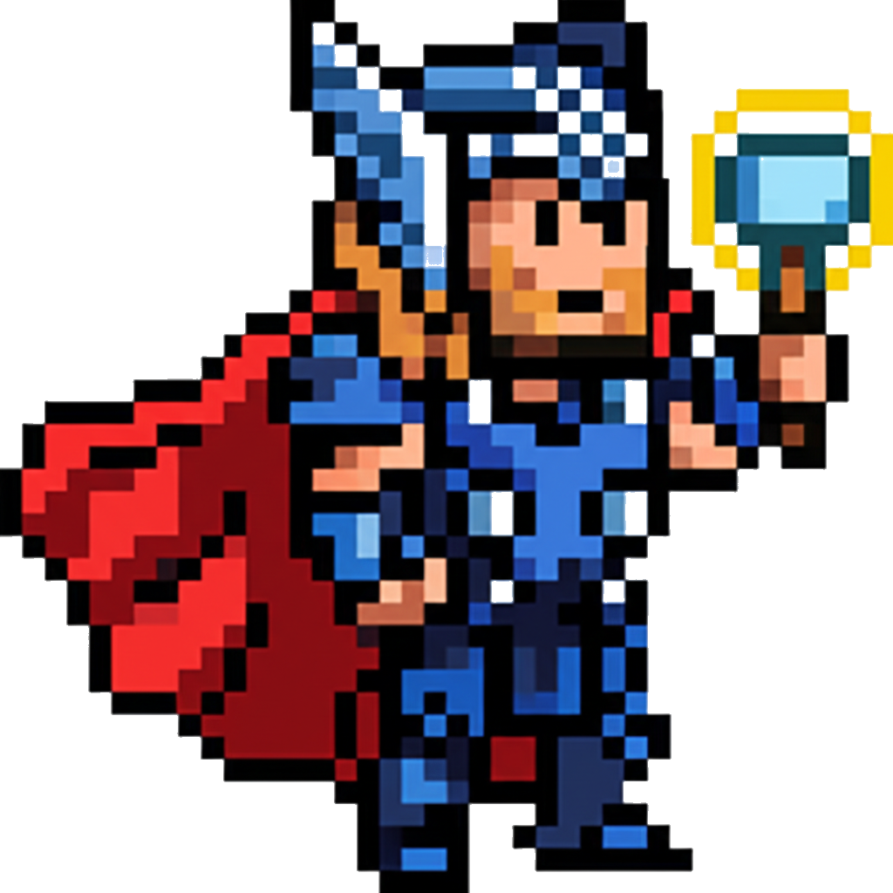
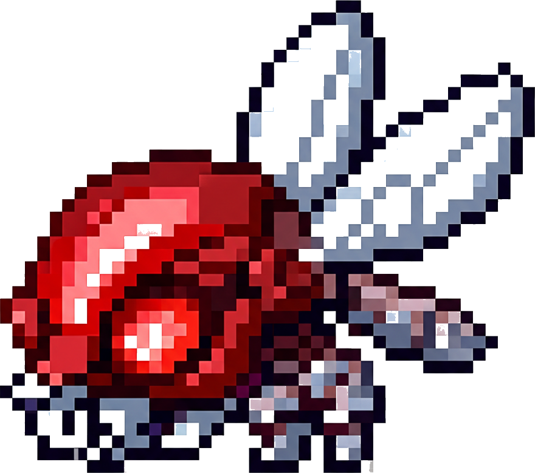
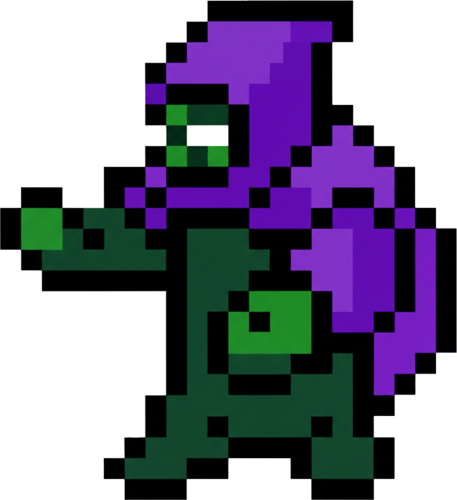
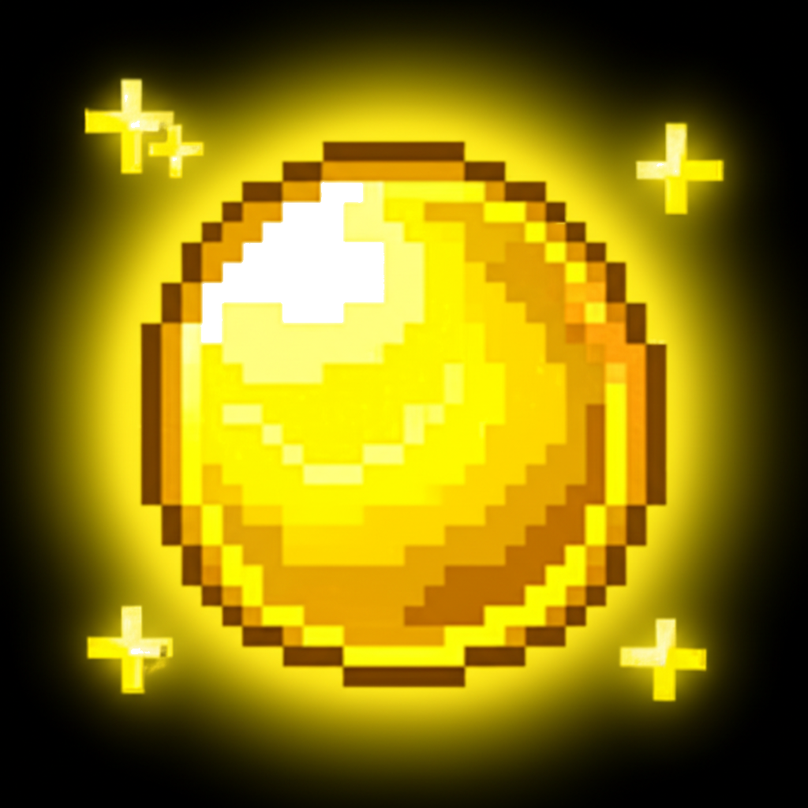
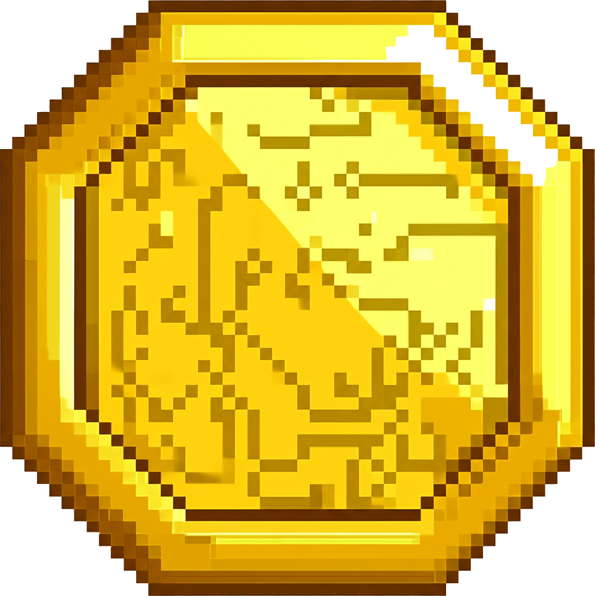
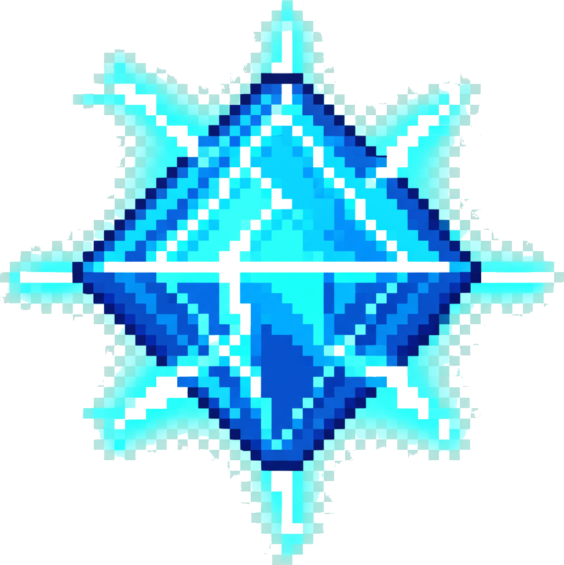
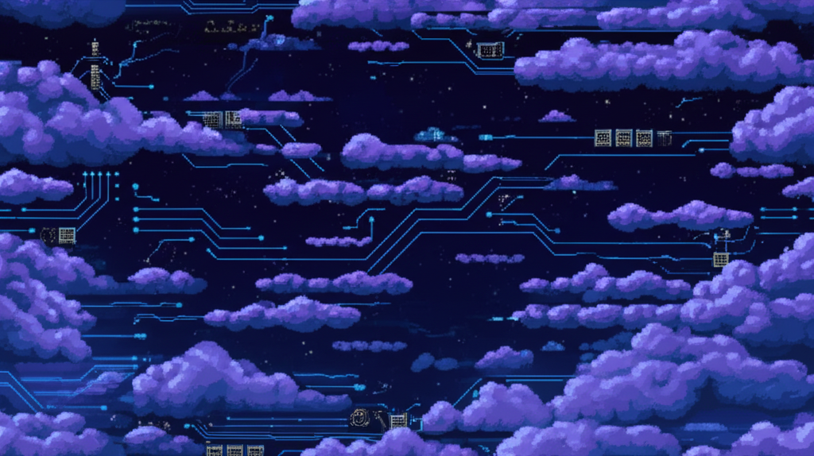

# How We Built a Video Game in 35 Minutes

Three 13-year-olds. One dad. An AI. And about 35 minutes.

No game engine. No coding bootcamp. No tutorials. Just six questions, some wild ideas, and a laptop.

This is the story of how **Cyber-Thor's Honey Heist** went from zero to playable arcade game in a single sitting — and how you can do it too.

---

## The Idea: What If Kids Designed a Game and AI Built It?

The concept was simple. What if we could take the creativity of a few teenagers, turn their ideas into a real game, and have the whole thing done before pizza arrived?

The trick was **asking the right questions**. Not "design a game" — that's too open. Teenagers will ask for a multiplayer open-world RPG, and you'll end up with a broken mess that takes days to fix. Instead, we used **6 targeted questions** that sound fun but secretly act as strict game design parameters.

Here are the six questions (from [docs/setup.md](docs/setup.md)):

| # | Question | What It Actually Controls |
|---|----------|--------------------------|
| 1 | *"What is the one main thing your character does?"* | The core game mechanic |
| 2 | *"Who or what are you playing as?"* | The player character |
| 3 | *"What is the one main thing trying to stop you?"* | Enemy behavior |
| 4 | *"Where does this take place?"* | Art direction and vibe |
| 5 | *"How do you win or get a high score?"* | Win/loss conditions |
| 6 | *"What is one funny or weird bonus that happens?"* | The wildcard twist |

That's it. Six questions. Each one locks down a piece of the game so the AI knows exactly what to build.

---

## The Session: Three Kids, Five Minutes, Pure Chaos

We sat down, hit record, and asked the questions. Here's what happened (full transcript in [docs/answers.md](docs/answers.md)):

**Question 1 — "What does your character do?"**
> "Collect pollen!" ... "Collect honey!" ... "Collect tokens!"

All three wanted collecting mechanics. Perfect — that's one verb, one core loop.

**Question 2 — "Who are you playing as?"**
> "Like Steve from Minecraft!" ... "Thor!" ... "The square from Geometry Dash!"

Somebody said "Four" and the dad goes "Four? What's four?" until it clicks — **Thor**. A blocky, Minecraft-style Thor. The hero was born.

**Question 3 — "What's trying to stop you?"**
> "A queen bee!" ... "Loki!" ... "Doctor Doom!"

We now had a Marvel villain roster fighting alongside an angry bee. Nobody questioned this.

**Question 4 — "Where does this happen?"**
> "On the pollen..." ... "In the clouds..." ... "Cybertron!"

Cybertron. Like Transformers. So now Thor is collecting honey on a cybernetic cloud world. Sure. Let's go.

**Question 5 — "How do you win?"**
> "Collect pollen, turn it into honey, honey gets you points!" ... "Defeat enemies for bonus points!" ... "Pick up tokens and your stats get better!"

They designed a three-layer scoring system without realizing it: pollen converts to honey (points), enemies give bonuses, and tokens buff your speed.

**Question 6 — "What's the one weird bonus thing?"**
> "A god comes from the cloud and says 'YOU ARE THE BEE! GET OUT OF MY BUSINESS!'"
> "You get struck by lightning and get zapped!"
> "If you pick up a certain token, Optimus Prime transforms and comes with a pack of Autobots!"

This is where it got unhinged. We ended up with:
- Random lightning strikes that stun you
- A floating god yelling at you about bees
- An **Optimus Rage** mode where you turn red, grow huge, and smash everything

Total time for the Q&A: **5 minutes**.

---

## From Answers to Game: The AI Prompt

The kids' answers were converted into a structured prompt — basically a mini Product Requirements Document (full version in [docs/short_prd.md](docs/short_prd.md)). The key specs:

- **Single `index.html` file** — no frameworks, no build tools, opens directly in Chrome
- **HTML5 Canvas** at 800x600 with a dark background
- **WASD/Arrow keys** to move Blocky Thor around
- **Pollen** (yellow circles) fills a bar — 10 pollen = 1 honey = +100 points
- **Gold tokens** (rare) permanently boost your speed by 10%
- **Blue tokens** (very rare) trigger Optimus Rage mode
- **Queen Bees** (fast, small) and **Loki/Doom** (slow, big, tracks you) as enemies
- **3 lives** — touch an enemy, lose one. Zero = Game Over.
- Lightning zaps, god clouds, and rage mode as wildcards

This prompt was fed to an AI coding agent, and the first playable version came back in minutes.

---

## Making It Look Real: AI-Generated Sprites

The initial version used colored squares and circles. It worked, but it didn't *feel* like a game yet. So we used **Google's Gemini** to generate pixel art sprites.

Here's what the AI drew for us:

### Blocky Thor (The Player)
<p align="center">
  
</p>

*Prompt: "A 2D 16-bit pixel art sprite of a blocky, Minecraft-style character dressed as Thor, holding a small glowing hammer. Blue armor, red cape, chibi proportions."*

### Queen Bee (Fast Enemy)
<p align="center">
  
</p>

*Prompt: "A small mechanical cyber Queen Bee enemy. Red and metallic colors, glowing red eyes, tiny buzzing wings, aggressive look."*

### Loki/Doom (Tracking Enemy)
<p align="center">
  
</p>

*Prompt: "A blocky comic-book villain in a purple hooded cloak, menacing pose. Purple and dark green colors, glowing eyes."*

### Collectibles
<p align="center">
  
  &nbsp;&nbsp;&nbsp;
  
  &nbsp;&nbsp;&nbsp;
  
</p>

*Pollen orb, Gold speed token, and the legendary Blue token (triggers Optimus Rage!)*

### The Background
<p align="center">
  
</p>

*The cybernetic cloudscape of Cybertron — dark indigo sky, neon circuitry, and metallic structures.*

Every sprite was generated with a single text prompt, saved as a PNG, then converted to Base64 so it could be embedded directly in the game file. No Photoshop needed.

The generation script is at [`tools/generate_sprites.sh`](tools/generate_sprites.sh) if you want to create your own.

---

## Adding Sound: Synthesized 8-Bit Audio

Games need sound. Rather than hunting for free audio clips, we wrote a Python script that **synthesizes retro 8-bit sound effects from scratch** using math — square waves, noise bursts, and frequency sweeps.

Here's what was generated:

| Sound | What It Does | How It Sounds |
|-------|-------------|---------------|
| `pollen_pickup` | Collect pollen | Quick rising chirp (600 to 1400 Hz) |
| `token_pickup` | Grab a token | Ascending chime arpeggio (C-E-G-C) |
| `enemy_hit` | Smack into an enemy | Descending buzz with noise |
| `lightning_zap` | Zeus strikes | Crackling noise + rumble + high zap |
| `rage_activation` | Optimus Rage begins | Sweeping power-up whoosh |
| `game_over` | You're done | Sad descending minor key tones |

Every sound is pure math — no audio files downloaded from the internet. The script is at [`tools/generate_sounds.sh`](tools/generate_sounds.sh).

---

## The Timeline

Here's roughly how 35 minutes broke down:

```
 0:00  ----  Sat down, explained the 6 questions
 0:05  ----  Q&A session done (answers recorded)
 0:10  ----  Fed the prompt to AI, first playable version generated
 0:15  ----  Playtesting and tweaking mechanics
 0:20  ----  Generated sprites with Gemini
 0:25  ----  Generated sound effects
 0:30  ----  Integrated everything into index.html
 0:35  ----  Done. Game running. Kids playing.
```

---

## Want to Try It Yourself?

### Play the Game
Just open `index.html` in Chrome. That's it. No install, no setup.

```
WASD or Arrow Keys  =  Move
Collect yellow pollen, avoid red enemies
Grab blue tokens for RAGE MODE
```

### Modify the Game
Everything is in one file: `index.html`. Open it in any text editor. The code is organized with section banners:

```javascript
// === CONSTANTS ===    ← All the numbers that control the game
// === PLAYER ===       ← Movement, input handling
// === ENEMIES ===      ← Spawning, movement, collision
// === ITEMS ===        ← Pollen, tokens, collection
// === WILDCARDS ===    ← Lightning, god cloud, rage mode
```

Want to change how fast enemies spawn? Find `ENEMY_SPAWN_BASE`. Want to make rage mode last longer? Change `RAGE_DURATION`. Every magic number is a named constant at the top of the file.

### Generate New Sprites
If you want different characters, edit the text prompts in `tools/generate_sprites.sh` and run:

```bash
# You'll need a Gemini API key in .env
./tools/generate_sprites.sh
```

### Generate New Sounds
Want different sound effects? Tweak the frequencies and waveforms in `tools/generate_sounds.sh`:

```bash
./tools/generate_sounds.sh
```

---

## The Point

You don't need to be a programmer to make a game. You need:

1. **A few good questions** to focus your ideas
2. **AI to do the heavy lifting** on code and art
3. **About 35 minutes** of your time

The entire game — mechanics, sprites, sounds, everything — was built by describing what we wanted in plain English. A 13-year-old said "Thor collects honey on Cybertron while dodging Doctor Doom and a god yells about bees," and 30 minutes later that was a real, playable game.

If that sounds fun to you, grab this repo and make it yours. Change the characters. Add new enemies. Make the god cloud say something different. Break it, fix it, make it weird.

It's your game now.

---

## What's in This Repo

```
index.html          ← THE GAME (open this in Chrome!)
assets/             ← Sprites and sounds loaded by the game
docs/               ← The design docs that started it all
  setup.md          ← The 6 questions methodology
  answers.md        ← Raw transcript of the kids' session
  short_prd.md      ← The full AI prompt / requirements doc
tools/              ← Scripts for regenerating assets
```
